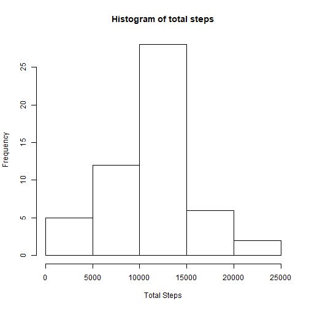
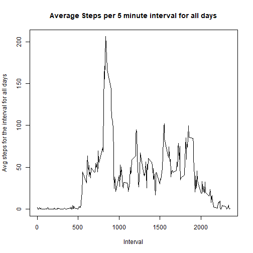
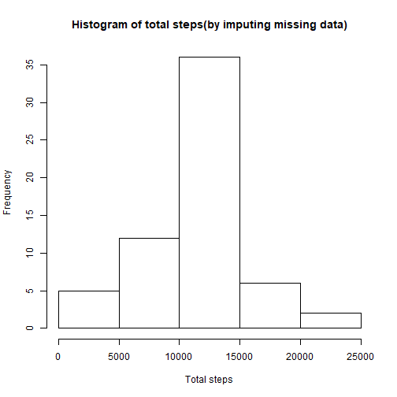
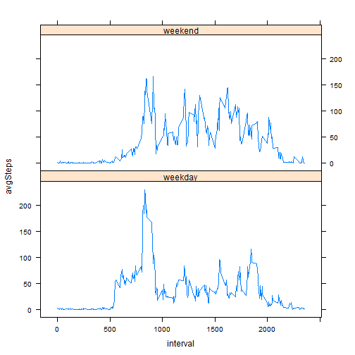

## Loading and preprocessing the data
### First we shall check if the file exists.

```r
if (!file.exists("activity/activity.csv")) {
        print("activity csv does not exist")
}
df <- read.csv("activity/activity.csv", stringsAsFactors = FALSE)
df$date <- as.Date(df$date, "%Y-%m-%d")
summary(df)
```

```
##      steps             date               interval     
##  Min.   :  0.00   Min.   :2012-10-01   Min.   :   0.0  
##  1st Qu.:  0.00   1st Qu.:2012-10-16   1st Qu.: 588.8  
##  Median :  0.00   Median :2012-10-31   Median :1177.5  
##  Mean   : 37.38   Mean   :2012-10-31   Mean   :1177.5  
##  3rd Qu.: 12.00   3rd Qu.:2012-11-15   3rd Qu.:1766.2  
##  Max.   :806.00   Max.   :2012-11-30   Max.   :2355.0  
##  NA's   :2304
```

```r
str(df)
```

```
## 'data.frame':	17568 obs. of  3 variables:
##  $ steps   : int  NA NA NA NA NA NA NA NA NA NA ...
##  $ date    : Date, format: "2012-10-01" "2012-10-01" ...
##  $ interval: int  0 5 10 15 20 25 30 35 40 45 ...
```

```r
head(df)
```

```
##   steps       date interval
## 1    NA 2012-10-01        0
## 2    NA 2012-10-01        5
## 3    NA 2012-10-01       10
## 4    NA 2012-10-01       15
## 5    NA 2012-10-01       20
## 6    NA 2012-10-01       25
```


## What is mean total number of steps taken per day?
### We will perform the sum using the aggregate function
### Next will calculate the mean and median

```r
library(dplyr)
library(ggplot2)
# Q 1.1
steps <- aggregate(df$steps,by = list(df$date), FUN = "sum")
colnames(steps) <- c("date","totalSteps")
steps
```

```
##          date totalSteps
## 1  2012-10-01         NA
## 2  2012-10-02        126
## 3  2012-10-03      11352
## 4  2012-10-04      12116
## 5  2012-10-05      13294
## 6  2012-10-06      15420
## 7  2012-10-07      11015
## 8  2012-10-08         NA
## 9  2012-10-09      12811
## 10 2012-10-10       9900
## 11 2012-10-11      10304
## 12 2012-10-12      17382
## 13 2012-10-13      12426
## 14 2012-10-14      15098
## 15 2012-10-15      10139
## 16 2012-10-16      15084
## 17 2012-10-17      13452
## 18 2012-10-18      10056
## 19 2012-10-19      11829
## 20 2012-10-20      10395
## 21 2012-10-21       8821
## 22 2012-10-22      13460
## 23 2012-10-23       8918
## 24 2012-10-24       8355
## 25 2012-10-25       2492
## 26 2012-10-26       6778
## 27 2012-10-27      10119
## 28 2012-10-28      11458
## 29 2012-10-29       5018
## 30 2012-10-30       9819
## 31 2012-10-31      15414
## 32 2012-11-01         NA
## 33 2012-11-02      10600
## 34 2012-11-03      10571
## 35 2012-11-04         NA
## 36 2012-11-05      10439
## 37 2012-11-06       8334
## 38 2012-11-07      12883
## 39 2012-11-08       3219
## 40 2012-11-09         NA
## 41 2012-11-10         NA
## 42 2012-11-11      12608
## 43 2012-11-12      10765
## 44 2012-11-13       7336
## 45 2012-11-14         NA
## 46 2012-11-15         41
## 47 2012-11-16       5441
## 48 2012-11-17      14339
## 49 2012-11-18      15110
## 50 2012-11-19       8841
## 51 2012-11-20       4472
## 52 2012-11-21      12787
## 53 2012-11-22      20427
## 54 2012-11-23      21194
## 55 2012-11-24      14478
## 56 2012-11-25      11834
## 57 2012-11-26      11162
## 58 2012-11-27      13646
## 59 2012-11-28      10183
## 60 2012-11-29       7047
## 61 2012-11-30         NA
```
### The histogram below shows the frequency of total number of steps between 10000 and 15000 is more than 25 times in the two months

```r
# Q 1.2
steps$row <- rownames(steps)
steps$row <- as.numeric(steps$row)
hist(steps$totalSteps, main = "Histogram of total steps", xlab = "Total Steps")
```



```r
# Q 1.3
mean(steps$totalSteps, na.rm = TRUE);median(steps$totalSteps, na.rm = TRUE)
```

```
## [1] 10766.19
```

```
## [1] 10765
```


## What is the average daily activity pattern?
### The average daily pattern below shows that the activity seems to be high around the interval 835( 8:00 - 9:00 am) minutes

```r
stepsInterval <- group_by(df,interval) %>% summarise(avgSteps = mean(steps, na.rm = TRUE))
plot(stepsInterval$interval, stepsInterval$avgSteps, type="l", xlab= "Interval", ylab= "Avg steps for the interval for all days", main = "Average Steps per 5 minute interval for all days")
```



```r
stepsInterval[which(stepsInterval$avgSteps==max(stepsInterval$avgSteps)), "interval"]
```

```
## # A tibble: 1 x 1
##   interval
##      <int>
## 1      835
```


## Imputing missing values
### There are around 2304 values missing and shown as NAs

```r
length(which(is.na(df)))
```

```
## [1] 2304
```

```r
dfNew <- df
naRows <- which(is.na(df[,1]))
length(naRows)
```

```
## [1] 2304
```

### Substituting the missing values with the average steps during that 5 minute interval

```r
for(i in 1 : length(naRows))
{
        k <- naRows[i]
        if(is.na(dfNew[k, 1]))
           {
        dfNew[k, "steps"] <- stepsInterval[which(stepsInterval[, "interval"]==dfNew[k, "interval"]), "avgSteps"]
        }
}
head(dfNew)
```

```
##       steps       date interval
## 1 1.7169811 2012-10-01        0
## 2 0.3396226 2012-10-01        5
## 3 0.1320755 2012-10-01       10
## 4 0.1509434 2012-10-01       15
## 5 0.0754717 2012-10-01       20
## 6 2.0943396 2012-10-01       25
```

### Drawing a histogram with the imputed values shows that the frequency of the number of steps between 10000 and 15000 is 35
### The mean and median have also significantly increased

```r
stepsNew <- aggregate(dfNew$steps,by = list(dfNew$date), FUN = "sum")
colnames(stepsNew) <- c("date","totalSteps")
stepsNew
```

```
##          date totalSteps
## 1  2012-10-01   10766.19
## 2  2012-10-02     126.00
## 3  2012-10-03   11352.00
## 4  2012-10-04   12116.00
## 5  2012-10-05   13294.00
## 6  2012-10-06   15420.00
## 7  2012-10-07   11015.00
## 8  2012-10-08   10766.19
## 9  2012-10-09   12811.00
## 10 2012-10-10    9900.00
## 11 2012-10-11   10304.00
## 12 2012-10-12   17382.00
## 13 2012-10-13   12426.00
## 14 2012-10-14   15098.00
## 15 2012-10-15   10139.00
## 16 2012-10-16   15084.00
## 17 2012-10-17   13452.00
## 18 2012-10-18   10056.00
## 19 2012-10-19   11829.00
## 20 2012-10-20   10395.00
## 21 2012-10-21    8821.00
## 22 2012-10-22   13460.00
## 23 2012-10-23    8918.00
## 24 2012-10-24    8355.00
## 25 2012-10-25    2492.00
## 26 2012-10-26    6778.00
## 27 2012-10-27   10119.00
## 28 2012-10-28   11458.00
## 29 2012-10-29    5018.00
## 30 2012-10-30    9819.00
## 31 2012-10-31   15414.00
## 32 2012-11-01   10766.19
## 33 2012-11-02   10600.00
## 34 2012-11-03   10571.00
## 35 2012-11-04   10766.19
## 36 2012-11-05   10439.00
## 37 2012-11-06    8334.00
## 38 2012-11-07   12883.00
## 39 2012-11-08    3219.00
## 40 2012-11-09   10766.19
## 41 2012-11-10   10766.19
## 42 2012-11-11   12608.00
## 43 2012-11-12   10765.00
## 44 2012-11-13    7336.00
## 45 2012-11-14   10766.19
## 46 2012-11-15      41.00
## 47 2012-11-16    5441.00
## 48 2012-11-17   14339.00
## 49 2012-11-18   15110.00
## 50 2012-11-19    8841.00
## 51 2012-11-20    4472.00
## 52 2012-11-21   12787.00
## 53 2012-11-22   20427.00
## 54 2012-11-23   21194.00
## 55 2012-11-24   14478.00
## 56 2012-11-25   11834.00
## 57 2012-11-26   11162.00
## 58 2012-11-27   13646.00
## 59 2012-11-28   10183.00
## 60 2012-11-29    7047.00
## 61 2012-11-30   10766.19
```

```r
stepsNew$row <- rownames(stepsNew)
stepsNew$row <- as.numeric(stepsNew$row)
hist(stepsNew$totalSteps, main = "Histogram of total steps(by imputing missing data)", xlab = "Total steps", ylab = "Frequency")
```



```r
mean(stepsNew$totalSteps, na.rm = TRUE);median(stepsNew$totalSteps, na.rm = TRUE)
```

```
## [1] 10766.19
```

```
## [1] 10766.19
```


## Are there differences in activity patterns between weekdays and weekends?
### Yes, the time series plot below shows the average steps in the 5 minute interval are higher in the weekend than on weekdays. The imputed data is used for these calculations

```r
library(timeDate)
getIsWeekendString <- function(x)
{
    if(isWeekday(x, wday=1:5))
    {
            return("weekday");
    }else
    {
            return("weekend");
    }
}
dfNew$dow <- as.factor(sapply(dfNew$date, getIsWeekendString))

par(mfrow=c(2,1))

dfNewWkday <- dfNew[which(dfNew$dow=="weekday"), ]
dfNewWkend <- dfNew[which(dfNew$dow=="weekend"), ]

stepsIntWkday <- group_by(dfNewWkday,interval) %>% summarise(avgSteps = mean(steps, na.rm = TRUE))
stepsIntWkend <- group_by(dfNewWkend,interval) %>% summarise(avgSteps = mean(steps, na.rm = TRUE))

stepsIntWkday$dow <- "weekday"
stepsIntWkend$dow <- "weekend"
stepsInt <- rbind(stepsIntWkday, stepsIntWkend)
stepsInt$dow <- as.factor(stepsInt$dow)

library(lattice)
xyplot(avgSteps~interval| dow,
       data = stepsInt,
       type = "l",
       layout=c(1,2)
      )
```




